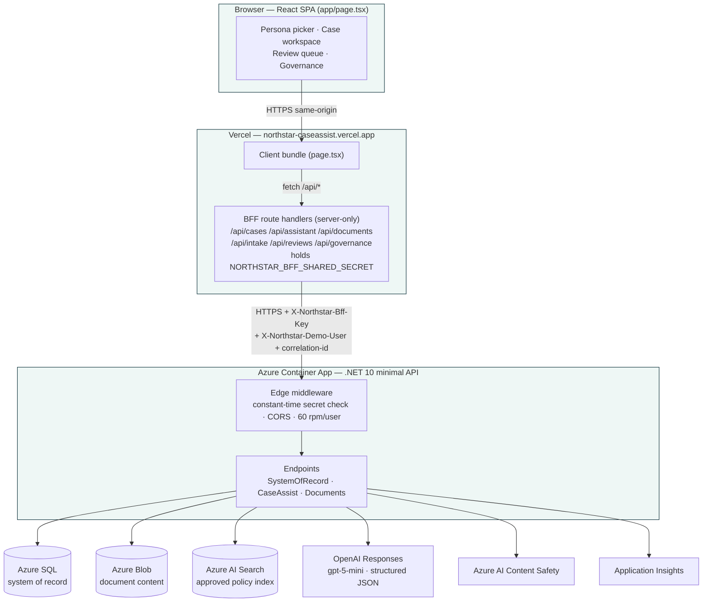
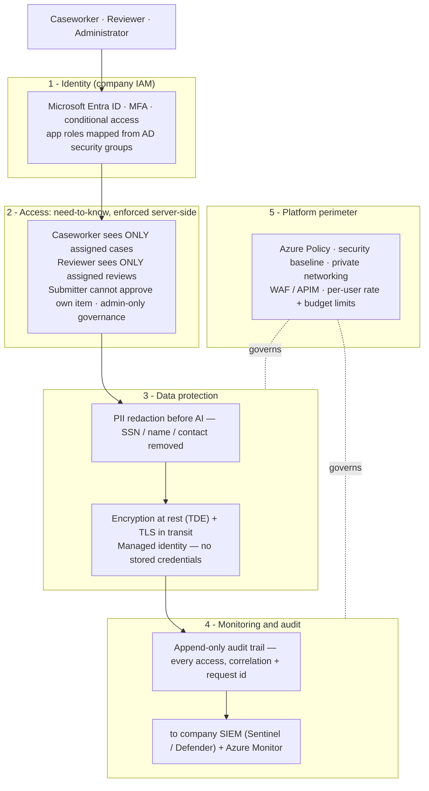
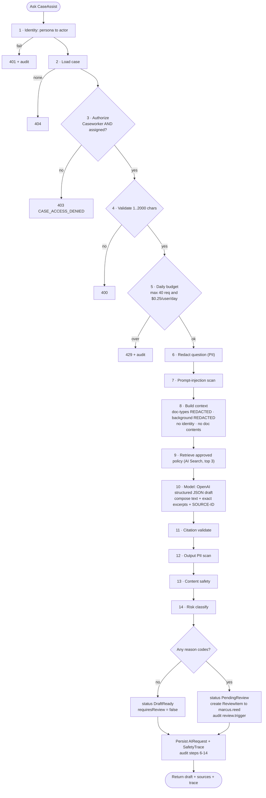
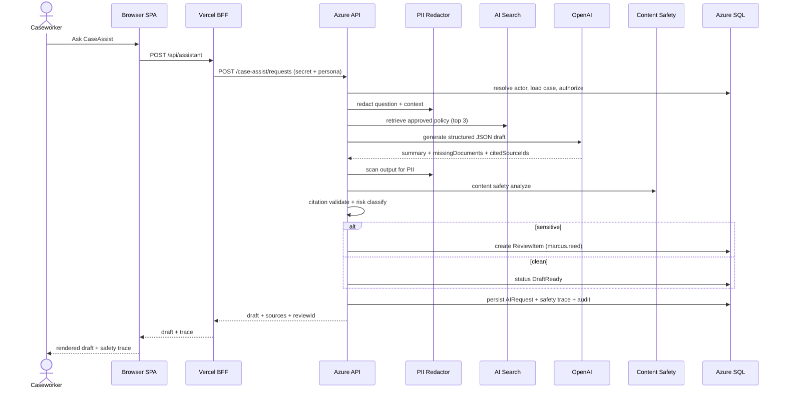
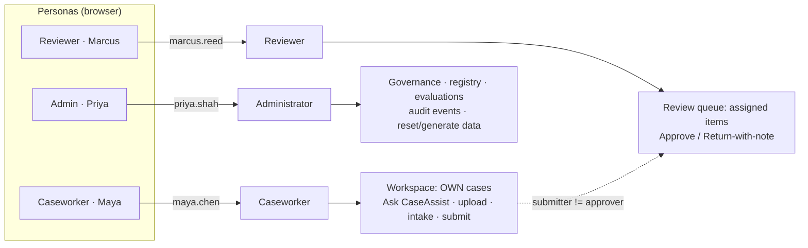
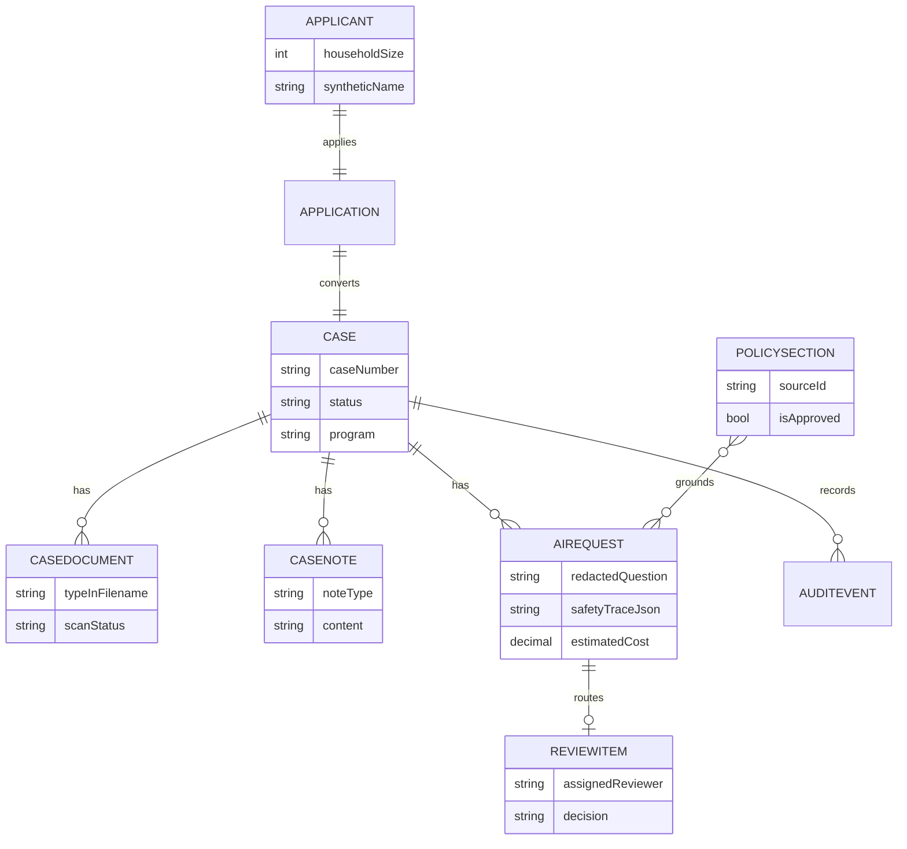
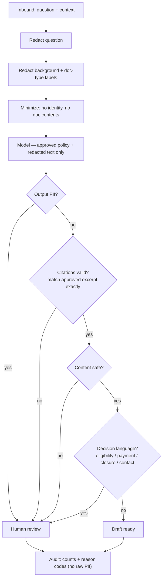

# Northstar CaseAssist — System Architecture

Responsible‑AI casework assistant. Core thesis: **redact on the way in, ground in approved
policy, validate on the way out, and never let the AI make the decision — a human does, and
every step is audited.**

---

## 1. Deployment topology & trust boundaries

**Trust boundary 1** = browser → Vercel (no secret ever in the browser).
**Trust boundary 2** = Vercel BFF → Azure API (shared secret + persona header). The API only
accepts traffic that presents the shared secret.

---

## 2. Enterprise security envelope — where the data is protected

The application runs **inside the agency's own Azure tenant**, under the company's existing
identity, logging, and cybersecurity controls. Protection is layered, so no single point
carries the whole burden — and case data (including an SSN in a case record) is scoped to the
**assigned caseworker only**, never broadly visible and never sent to the AI.

| Layer | Control | Enforced where |
|---|---|---|
| **Identity** | Entra ID, MFA, app role from AD security groups | Company IAM platform (the demo stubs identity as a persona switch; the authorization that consumes it is real) |
| **Access (need-to-know)** | Caseworker → only assigned cases; reviewer → only assigned reviews; separation of duties | Application, **server-side, today** (`AssignedWorkerId == actor.UserId`; denials audited) |
| **Data protection** | PII redaction before the model; TDE at rest; TLS in transit; managed identity (no stored secrets) | Application + Azure, **today** |
| **Monitoring & audit** | Append-only audit trail of every access → company SIEM; Azure Monitor / App Insights | Audit **today**; SIEM ingestion in production |
| **Platform perimeter** | Azure Policy / security baseline, private networking, WAF/APIM, per-user rate & budget limits | Rate/budget **today**; network/WAF in production |

**On the SSN specifically:** it is stored in the case record (Azure SQL, encrypted at rest),
visible only to the caseworker the case is assigned to, and **stripped by the PII redactor
before any request reaches the AI** — so it satisfies casework need-to-know while never
entering the model or the model provider's logs.

---

## 3. The governed CaseAssist pipeline

Fires on **Ask CaseAssist**. Every numbered step writes an audit event.

---

## 4. Request sequence (who calls whom)

---

## 5. Roles, persona routing & separation of duties

Enforced server-side: caseworkers see only their own cases; reviewers decide only items
assigned to them; a submitter can never approve their own item; only admins read audit
events or run evaluations.

---

## 6. Data model (Azure SQL — all rows synthetic)

`CaseNote` of type `CaseBackground` is the (redacted) text fed to the model as context.
Document **content** lives in Blob and is never sent to the model — only the type (filename).

---

## 7. PII & decision gates

---

## Environments

| Layer | Value |
| --- | --- |
| Frontend | `https://northstar-caseassist.vercel.app` (Vercel, Next.js standalone) |
| API | Azure Container App `aca-northstar-api-dev-ta542fwh` (.NET 10) |
| Image | `acrnorthstardevta542fwh.azurecr.io/northstar-api:dev-20260816-11` |
| Model | OpenAI `gpt-5-mini`, Responses API, strict JSON schema |
| Data | Azure SQL · Blob · AI Search · AI Content Safety · App Insights |
