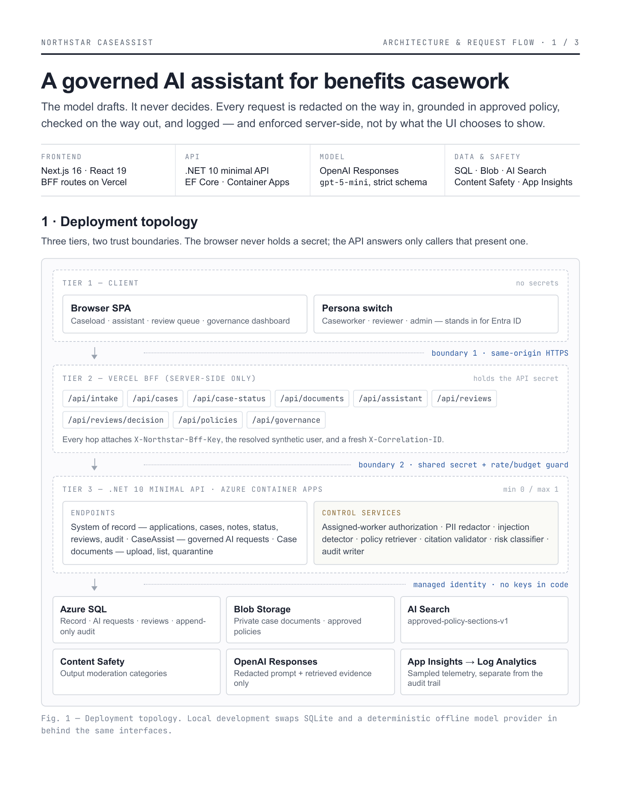
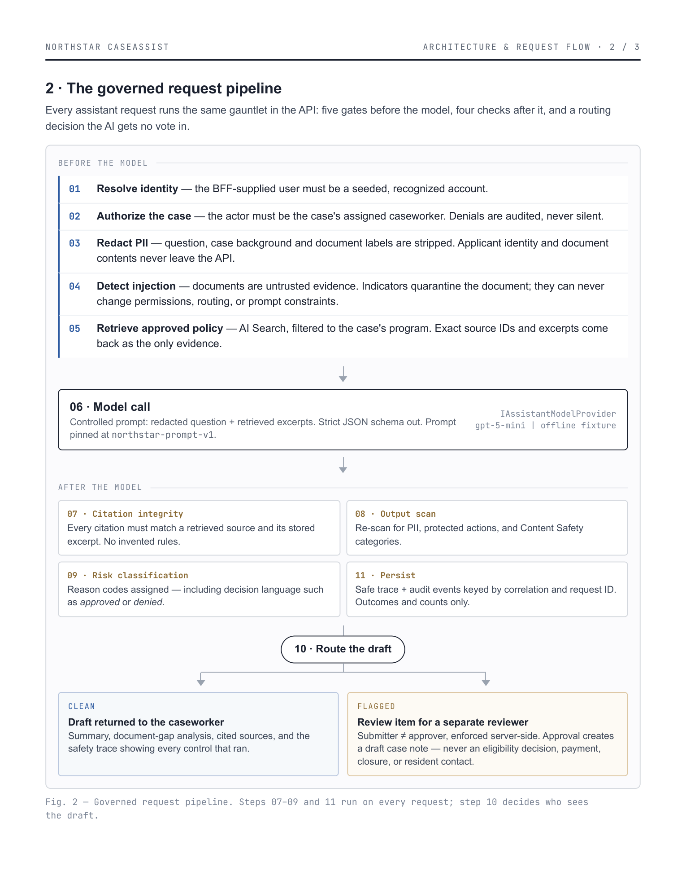
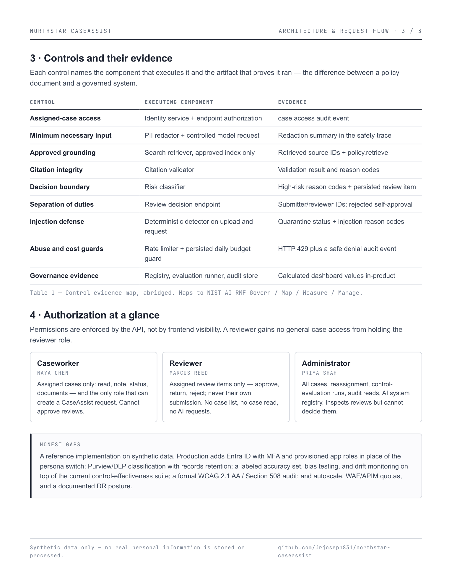

# Northstar CaseAssist

A governed AI assistant for benefits casework. The model drafts. It never decides.

**Live demo:** https://northstar-caseassist.vercel.app

---







---

## Run it locally

Local development uses SQLite and a deterministic offline model — no cloud dependencies, no model cost.

```bash
# API (.NET 10)
dotnet test
dotnet run --project src/Northstar.Api

# Frontend (Next.js)
npm install && npm run dev
```

Role checks use the `X-Northstar-Demo-User` header (`maya.chen`, `marcus.reed`, `priya.shah`) in place of Entra ID.

---

## Docs

- [Governance summary](docs/ai-governance-summary.md)
- [AI system card](docs/ai-system-card.md)
- [STRIDE threat model](docs/threat-model.md)
- [Controls, classification & retention](docs/controls-and-data.md)
- [Role & permission matrix](docs/role-permission-matrix.md)
- [Evaluation methodology](docs/evaluation-methodology.md)
- [AI safety pipeline](docs/ai-safety-pipeline.md)
- [Operations runbook](docs/operations-runbook.md)
- [Demo script](docs/demo-script.md)

*Synthetic data only — no real personal information is stored or processed.*
