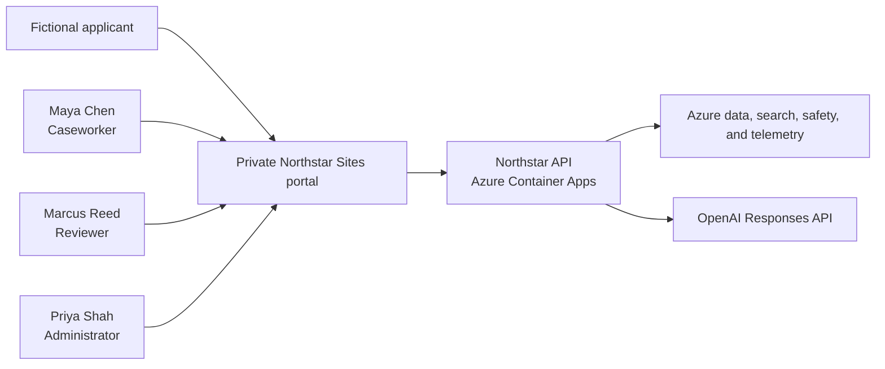
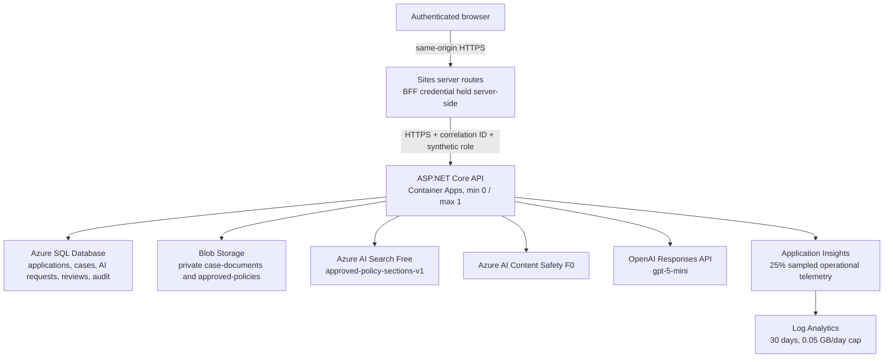
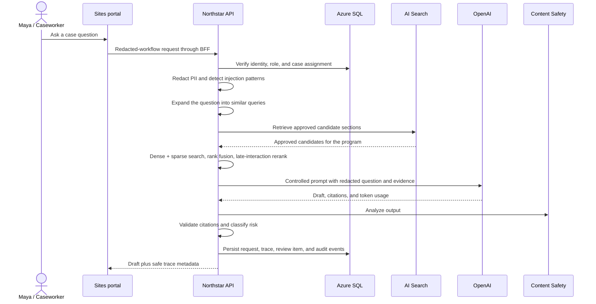
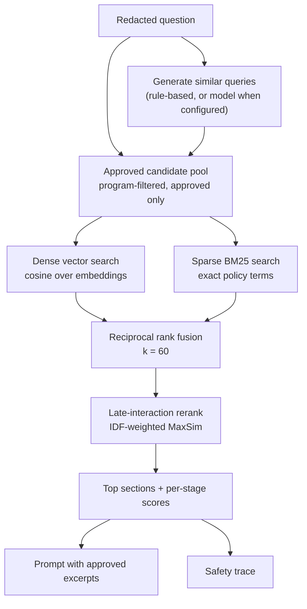

# Architecture and data flow

Northstar CaseAssist is a synthetic-data-only reference system. The Sites portal
is the presentation tier; the ASP.NET Core API on Azure Container Apps is the
system-of-record and orchestration boundary. Browsers never receive service
credentials or connect directly to Azure data or model services.

## System context

## Deployed containers and services

## AI request sequence

## Retrieval pipeline

Every answer is grounded in approved policy sections, and how those sections are
chosen is part of the control surface. One keyword search of the caseworker's
exact wording is not enough: caseworkers ask in caseworker language and the
corpus is written in policy language.

| Stage | What it contributes | Default |
|---|---|---|
| Query expansion | Rewrites the question into policy wording so a section is not missed for vocabulary reasons | Rule-based, 4 variants plus the original |
| Dense search | Matches on meaning when wording differs | Local deterministic embedding, 256d; hosted embeddings when configured |
| Sparse search | Matches the exact terms a policy turns on, which vectors blur | BM25, k1 = 1.4, b = 0.75 |
| Fusion | Combines rankings that are on different scales, promoting what several searches agree on | Reciprocal rank fusion, k = 60 |
| Reranking | Scores question tokens against section tokens instead of one blended vector | IDF-weighted MaxSim, 25% of the final score |

Two deliberate choices are worth naming. First, the offline path uses a local
deterministic embedding rather than a hosted one: it costs nothing, adds no
network call, and returns the same vector every time, which is what makes an
evaluation run reproducible. Setting `Retrieval:EmbeddingProvider` to `OpenAI`
swaps in hosted embeddings, and a failed embedding call falls back to the local
model for that request with the served model recorded in the trace.

Second, fusion leads and reranking refines. Sweeping the rerank weight against
the labeled question set showed recall and MRR falling once the reranker
outvoted the agreement between searches — on a corpus this small, agreement is
the stronger signal. The weight is configuration, not a constant, because that
balance shifts as a corpus grows.

When `Search:Provider` is `AzureAiSearch`, the service supplies the candidate
pool and its own relevance ranking joins the fusion as one more ranked list; the
dense, sparse, fusion and reranking stages run in the API either way.

## Trust boundaries

- Browser to Sites: authenticated private-site boundary.
- Sites to API: secret-backed BFF boundary; no service secret enters client code.
- API to Azure services: user-assigned managed identity for Blob, Search, and
  Content Safety.
- API to SQL/OpenAI: host-managed secret references in the reference deployment.
- Application audit records are distinct from sampled operational telemetry.

## Reference substitutions

| Reference implementation | Production mapping |
|---|---|
| Private Sites portal and synthetic persona selector | Entra ID app roles and Conditional Access |
| BFF shared credential | Entra workload identity or managed identity federation |
| Container Apps public ingress restricted by BFF middleware | APIM plus private ingress/network controls |
| Structured audit table and dashboard | Export to Log Analytics/Sentinel |
| Deterministic injection detector | Retain it and add Prompt Shields/defense-in-depth |
| OpenAI provider interface | Azure OpenAI provider with the same application contract |

