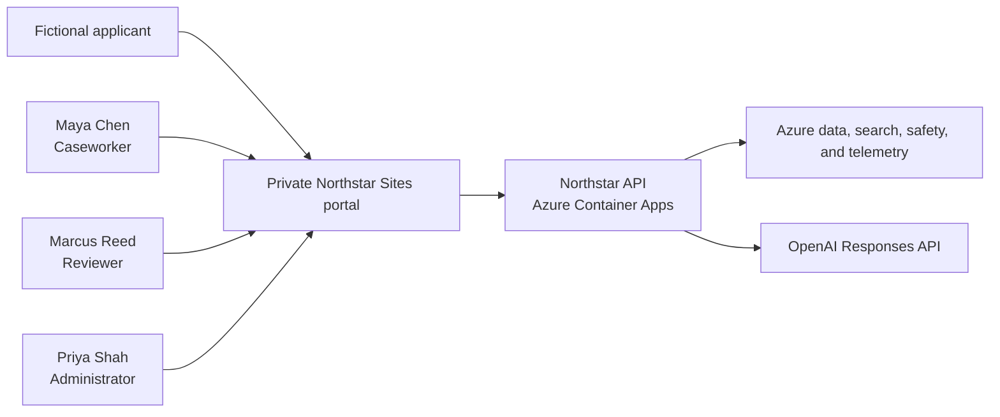
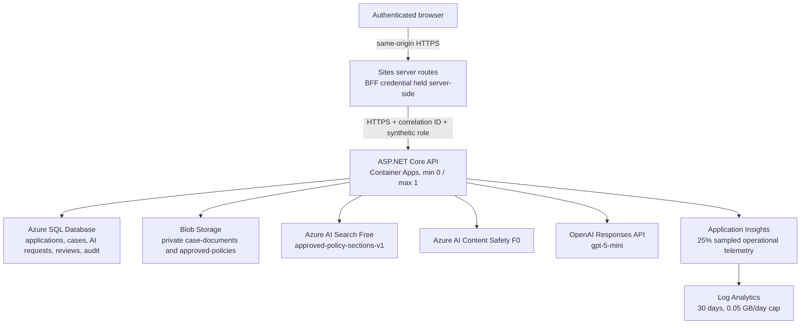
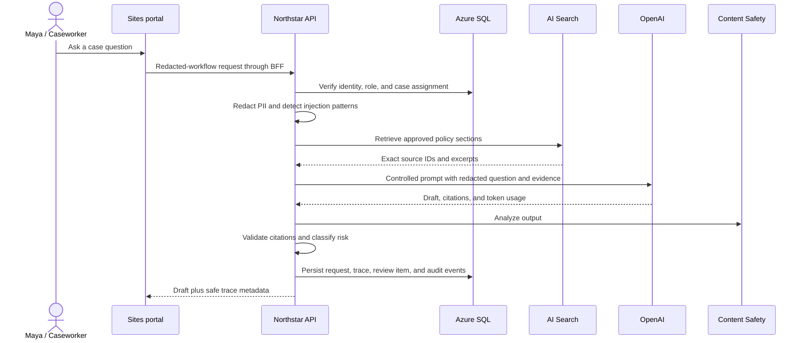

# Architecture and data flow

Northstar CaseAssist is a synthetic-data-only reference system. The Sites portal
is the presentation tier; the ASP.NET Core API on Azure Container Apps is the
system-of-record and orchestration boundary. Browsers never receive service
credentials or connect directly to Azure data or model services.

## System context

## Deployed containers and services

## AI request sequence

## Trust boundaries

- Browser to Sites: authenticated private-site boundary.
- Sites to API: secret-backed BFF boundary; no service secret enters client code.
- API to Azure services: user-assigned managed identity for Blob, Search, and
  Content Safety.
- API to SQL/OpenAI: host-managed secret references in the reference deployment.
- Application audit records are distinct from sampled operational telemetry.

## Reference substitutions

| Reference implementation | Production mapping |
|---|---|
| Private Sites portal and synthetic persona selector | Entra ID app roles and Conditional Access |
| BFF shared credential | Entra workload identity or managed identity federation |
| Container Apps public ingress restricted by BFF middleware | APIM plus private ingress/network controls |
| Structured audit table and dashboard | Export to Log Analytics/Sentinel |
| Deterministic injection detector | Retain it and add Prompt Shields/defense-in-depth |
| OpenAI provider interface | Azure OpenAI provider with the same application contract |

